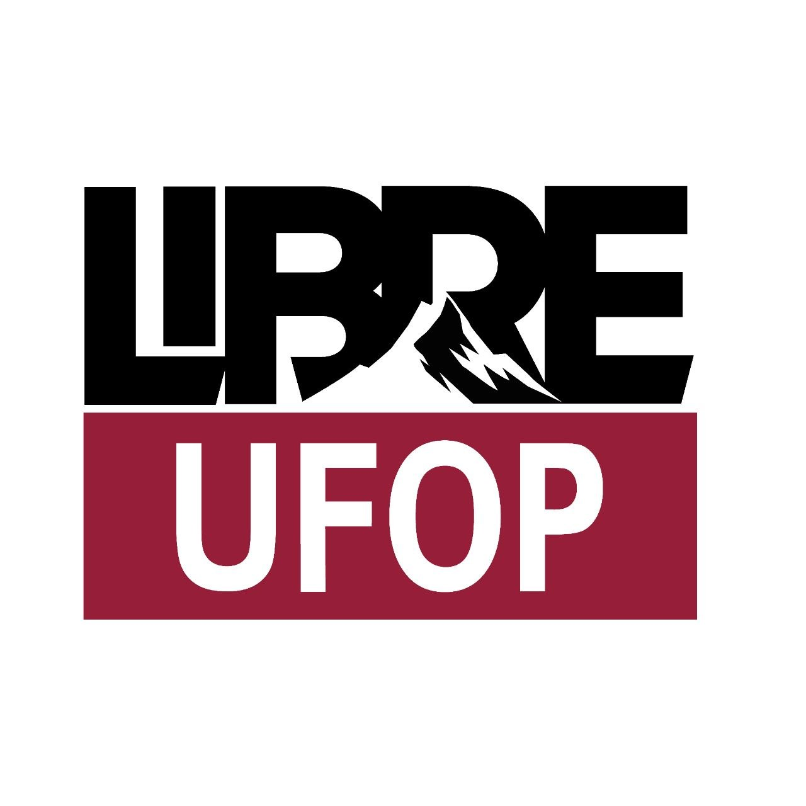

  
    
  <h1>LibreUFOP</h1>

 

  

  Projeto de extensão da Universidade Federal de Ouro Preto, Campus ICEA, voltado à promoção do software livre, soberania digital, inclusão tecnológica e compartilhamento de conhecimento aberto.
  

**Mais detalhes:** https://lecompufop.github.io/LibreUFOP/

---

### Sobre o Projeto

  

  O <b>LibreUFOP</b> é uma iniciativa acadêmica e comunitária criada no campus ICEA da UFOP, em João Monlevade – MG. O projeto aproxima universidade, comunidade e movimentos de tecnologia livre por meio de atividades práticas, formação e produção colaborativa de conhecimento.

  O projeto promove:

  * Oficinas práticas, palestras e grupos de estudo
  * Eventos e encontros sobre GNU/Linux, software livre e cultura hacker
  * Formação introdutória e continuada em tecnologias abertas
  * Discussões sobre privacidade, autonomia e soberania digital
  * Integração entre estudantes, docentes, comunidade e projetos independentes
  * Produção e compartilhamento de materiais didáticos sob licenças livres

  Mais do que ensinar ferramentas, o LibreUFOP busca fortalecer a autonomia tecnológica, estimular o pensamento crítico e democratizar o acesso ao conhecimento.
  

### Atividades

As atividades são abertas à comunidade e podem incluir:

* Oficinas de instalação, configuração e uso de sistemas livres
* Laboratórios práticos de programação, redes, servidores e infraestrutura
* Encontros para leitura, experimentação e discussão de tecnologias abertas
* Publicação de guias, apresentações, exercícios e outros materiais de apoio
* Participação em comunidades, eventos e projetos de software livre

### Objetivos do Projeto

* Promover o uso, o estudo e a produção de software livre
* Incentivar a cultura FLOSS, a colaboração e o compartilhamento de conhecimento
* Aproximar a universidade da sociedade por meio de ações de extensão
* Democratizar o acesso à educação e às tecnologias digitais
* Desenvolver autonomia para instalar, compreender, adaptar e manter tecnologias
* Fortalecer comunidades abertas e redes de cooperação
* Estimular práticas de privacidade, segurança e soberania digital

### Como Participar

Estudantes, servidores, pesquisadores e integrantes da comunidade podem participar das atividades, propor oficinas, colaborar na produção de materiais ou contribuir com melhorias neste repositório. Acompanhe os canais do projeto para conhecer a programação e as próximas ações.

* Telegram: [t.me/libreufop](https://t.me/libreufop/1)
* Repositório: [github.com/lecompufop/LibreUFOP](https://github.com/lecompufop/LibreUFOP)

### Licença

**CC BY-SA 4.0**

Este projeto pode ser compartilhado e adaptado, desde que os créditos sejam mantidos e as obras derivadas sejam distribuídas sob a mesma licença.

Mais informações em [creativecommons.org/licenses/by-sa/4.0](https://creativecommons.org/licenses/by-sa/4.0/).

# Autor

Projeto desenvolvido por Vinícius "Alochio" Alochio.

Contribuídores: Guilherme "glermFF" Ferreira e Jonas "Jonas-C" Campos

> “Programar liberta!”